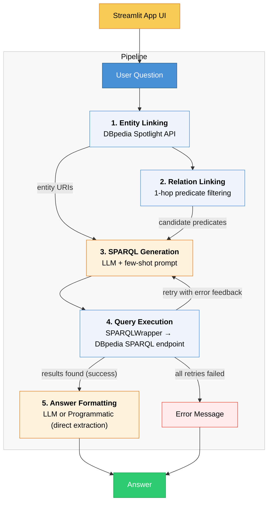

# KGQA_AML — Knowledge Graph Question Answering System

A hybrid pipeline that answers natural language questions using the [DBpedia](https://www.dbpedia.org/) Knowledge Graph. Built as a course project for **Advanced Machine Learning** (WS 2025/26) at the Leuphana University of Lüneburg.

**Author:** Farmand Bazdiditehrani (4005007) - March 2026

**Instructors:** Dr. Debayan Banerjee and Kai Moltzen

You can access the Streamlit UI here.

## Architecture



### Key Design Decisions

- **Relation Linking step** constrains the LLM to real DBpedia predicates from the entity's 1-hop neighborhood, reducing predicate hallucination.
- **Cascading entity linking** tries spaCy pipeline first, then falls back to direct Spotlight API with lower confidence.
- **SPARQL retry with error feedback** — if a generated query fails or returns empty results, the error is fed back to the LLM for self-correction.
- **Hybrid answer formatting** — simple single-value results skip the LLM; complex results use LLM formatting.

## Tech Stack

| Component | Technology |
|-----------|-----------|
| Language | Python 3.11+ |
| Web UI | Streamlit |
| NLP | spaCy |
| Entity Linking | spacy-dbpedia-spotlight |
| SPARQL Queries | SPARQLWrapper |
| LLM API | GWDG SAIA (OpenAI-compatible) |
| HTTP | requests |

## Installation

1. **Clone the repository**
   ```bash
   git clone https://github.com/<your-username>/KGQA_AML.git
   cd KGQA_AML
   ```

2. **Create and activate a virtual environment**
   ```bash
   python -m venv venv
   # Linux / macOS
   source venv/bin/activate
   # Windows
   venv\Scripts\activate
   ```

3. **Install dependencies**
   ```bash
   pip install -r requirements.txt
   ```

4. **Configure environment variables**
   ```bash
   cp .env.example .env
   # Edit .env and add your GWDG SAIA API key
   ```

## Usage

**Run the web app:**
```bash
streamlit run app.py
```

**Filter LC-QuAD dataset** (test which questions work on live DBpedia):
```bash
python -m src.filter_lcquad
```

**Evaluate pipeline accuracy** against filtered LC-QuAD:
```bash
python -m src.evaluate --limit 50
```

## Project Structure

```
KGQA_AML/
├── app.py                  # Streamlit web interface (entry point)
├── src/
│   ├── __init__.py
│   ├── pipeline.py         # Main KGQA pipeline orchestrator
│   ├── entity_linker.py    # DBpedia Spotlight entity linking (cascading)
│   ├── relation_linker.py  # 1-hop relation filtering + ranking
│   ├── sparql_generator.py # LLM-based SPARQL generation (few-shot + retry)
│   ├── sparql_executor.py  # Execute SPARQL against DBpedia
│   ├── answer_formatter.py # Format raw results into NL answers
│   ├── llm_client.py       # GWDG SAIA API client wrapper
│   ├── filter_lcquad.py    # Filter LC-QuAD for working questions
│   └── evaluate.py         # Evaluate pipeline against ground truth
├── data/
│   ├── LCQuAD-test-data.json # LC-QuAD test dataset
│   ├── lcquad_filtered.json  # Filtered questions (generated)
│   └── questions.txt         # Working and non-working questions list
├── .env.example             # Template for API keys
├── requirements.txt
├── AUTHORS
├── LICENSE
└── README.md
```

## Dataset

This project uses the [LC-QuAD](https://github.com/AskNowQA/LC-QuAD) dataset for evaluation. Since not all LC-QuAD questions work against the live DBpedia SPARQL endpoint, the dataset is filtered using `python -m src.filter_lcquad` to retain only questions that return valid results.

## Links

- [DBpedia SPARQL Endpoint](https://dbpedia.org/sparql)
- [DBpedia Spotlight API](https://api.dbpedia-spotlight.org/en/annotate)
- [GWDG SAIA Documentation](https://docs.hpc.gwdg.de/services/saia/index.html)
- [LC-QuAD Dataset](https://github.com/AskNowQA/LC-QuAD)

## License

See [LICENSE](LICENSE) for details.
